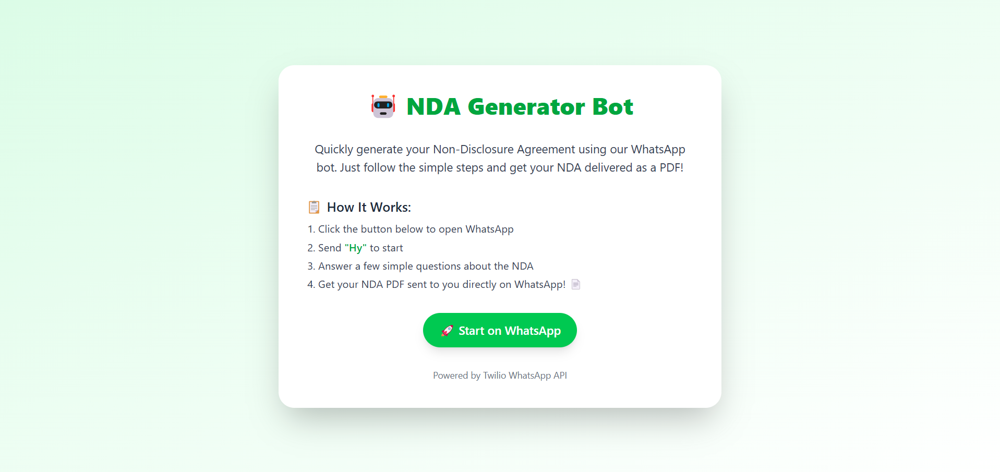

# 📄 WhatsApp NDA Generator Bot

A powerful WhatsApp-based bot built using **Twilio**, **Node.js**, and **Tailwind CSS** that enables users to generate a personalized Non-Disclosure Agreement (NDA) document with just a simple conversation!

---

## 🚀 Features

- Interactive WhatsApp bot flow to collect NDA details
- Generates professional-looking NDA in PDF format
- Automatically sends the PDF file via WhatsApp
- Simple and clean landing page with WhatsApp redirect + date picker
- Session-based user data handling

---

## 🌐 Demo Screenshots

### 🖥️ Landing Page
> Clean UI with CTA to start WhatsApp-based NDA generation.



---

### 🎥 Demo Video
> Walkthrough of the WhatsApp NDA bot flow and PDF download via chat.


---

### 📄 Generated NDA PDF Preview
> Automatically styled and structured PDF delivered on WhatsApp.


---

## 📦 Tech Stack Used

| Technology   | Purpose                        |
|-------------|---------------------------------|
| Node.js      | Backend server & API logic     |
| Express.js   | Route handling and middleware  |
| Twilio API   | WhatsApp chatbot integration   |
| PDFKit       | NDA PDF document generation    |
| Tailwind CSS | Frontend styling               |
| Ngrok        | Public HTTPS tunnel for local server |
| HTML/CSS     | Landing page                   |

---

## 💡 Why Twilio?

Twilio was chosen for this project because:

- It provides a **reliable and scalable WhatsApp Business API**.
- Built-in support for **media file transfers** (like PDFs).
- Easy session-based interaction via **webhooks**.
- Great documentation and sandbox for development.

This makes it the perfect fit for **document-based automation over chat**.

---

## 🛠️ Setup Instructions

1. **Clone the Repo**
   ```bash
   git clone https://github.com/your-username/whatsapp-nda-bot.git
   cd whatsapp-nda-bot
